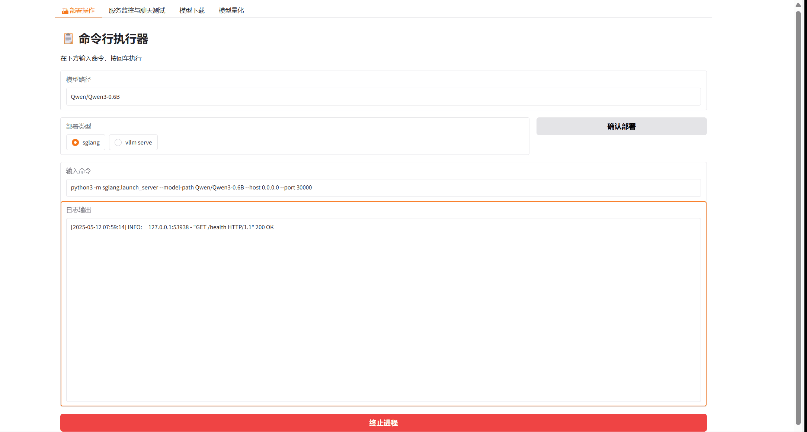

# LLM一键向导（LLM One-Tap Wizard）
[中文](README_ZH.md) [英文](README.md) 
🔥 LLM一键向导：轻松实现模型下载、部署、量化与聊天测试
🎉 一款超级便捷的大语言模型一体化工具！只需一键操作，即可完成模型下载、部署、量化，甚至能立即进行聊天测试。与谷歌Colab无缝兼容，让你随时随地开启大语言模型的探索之旅！

## 🌟 核心功能
- **极速下载**：输入模型的Git仓库网址和保存路径，轻松将心仪的模型导入本地。
- **智能部署**：支持诸如sglang和vllm serve等多种部署类型，让你瞬间搭建好模型服务。
- **高效量化**：借助预设配置，一键实现模型量化，优化性能和存储。
- **即时测试**：部署完成后马上开始聊天测试，快速验证模型的有效性。

## 🚀 主要亮点
✅ **极简操作**：无需复杂的命令或配置。图形化界面，新手也能轻松上手。
✅ **Colab兼容**：可在云端运行，无需高端的本地硬件，零门槛获取大语言模型的能力。
✅ **实时监控**：随时跟踪服务状态，进程管理全透明，一切尽在掌握之中。

## 📦 快速开始
1. 将本项目仓库克隆到你的本地计算机或谷歌Colab环境中。
2.运行main.py，启动Gradio界面。
3.在相应的标签页中输入参数，然后点击按钮，轻松完成各项操作！

深入大语言模型的神奇世界，即刻开启你的人工智能冒险之旅！🚀 
